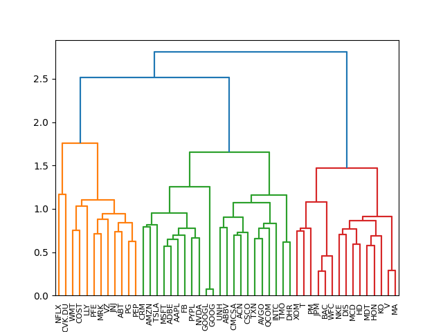

# PyHRP

## Summary

PyHRP is a library for hierarchical risk-based portfolios which allows users to create full-investment, long-only portfolios using techniques and strategies as outlined in "Hierarchical risk parity: Accounting for tail dependencies in multi-asset multi-factor allocations" by Harald Lohre et al. 

## The Algorithm

The algorithm which this library is based upon is taken directly from Lohre et al.

1. Perform Hierarchical clustering and generate a dendrogram
2. Assign all assets a unit weight &omega;i = 1 &forall;i = 1,...,N
3. For each dendrogram node (beginning from the top): 
    1. Determine the members of the clusters C1 and C2 belonging to the two sub-branches of the according dendrogram node
    2. Calculate the within-cluster allocations &omega;'1 and &omega;'2 for C1 and C2 according to the chosen methodology (more on this below)
    3. Based on the within-cluster allocations &omega;'1 and &omega;'2 calculate the across-cluster allocation &alpha; (splitting factor) for C1 and (1-&alpha;) for C2
    4. For each asset in C1 re-scale allocation &omega; by factor &alpha;
    5. For each asset in C2 re-scale allocation &omega; by factor (1-&alpha;)
4. End   
    
## Hierarchical Clustering

Hierarchical clustering is first performed in order to group together timeseries in a dendrogram which are (a) highly correlated or (b) share similar correlation structures across the entire portfolio or (c) are highly likely to experience downturns simultaneously (more on this below). The resulting dendrogram will result in a binary tree looking something like this:

### The Dissimilarity Matrix

The dissimilarity matrix is an integral component to generating dendrograms like the one above. The dissimilarity matrix explains how "dissimilar" each two pair of timeseries within our universe are. PyHRP provides implementations for three different types of dissimilarity matrices to be chosen by the user.

#### CorrDissimilarity
A dissimilarity matrix based on 'CorrDissimilarity' dissimilarities has its (i,j)th element equal to ((1-pi,j)/2)1/2. Hence, positively correlated timeseries are deemed 'similar', while negatively correlated timeseries are deemed 'not similar'. 

#### PortfolioDissimilarity
A dissimilarity matrix based on 'Portfolio' dissimilarities has its (i,j)th element equal to l2-norm of the difference between vectors of 'CorrDissimilarities' belonging to the ith timeseries and the jth timeseries. This dissimilarity metric takes into account not only how two timeseries are correlated, but how they correlate to the rest of the portfolio. 

#### LTDCDissimilarity
A dissimilarity matrix based on lower-tail-dependency coefficients (LTDCs) between pairs of timeseries. The LTDC of timeseries i and j is defined by the limit of
&lambda;(c) = P(Xi < c | Xj < c) as c &rarr; &infin;. In order to estimate the LTDC, PyHRP uses psuedo-maximum-likelihood estimation on the bivariate Clayton copula. This dissimilarity metric is often seen as more robust than the previous two as LTDCs don't rely on correlations. Correlations between two types of stocks can be quite volatile, and tend to increase dramatically during market downturns. In order to use this metric, the user must be equipped with timeseries data that is roughly iid. Since financial timeseries data is almost never iid, some level of preprocessing is required when using LTDCs. Giovanni De Luca suggest using the standardized residuals of an AR(1)-GARCH(1,1) model in order to accomplish this.

### Resources
1. Daniel Mullner, “Modern hierarchical, agglomerative clustering algorithms”, https://arxiv.org/abs/1109.2378v1
2. Documentation for the hierarchical clustering algorithm used in PyHRP:  https://docs.scipy.org/doc/scipy/reference/generated/scipy.cluster.hierarchy.linkage.html
